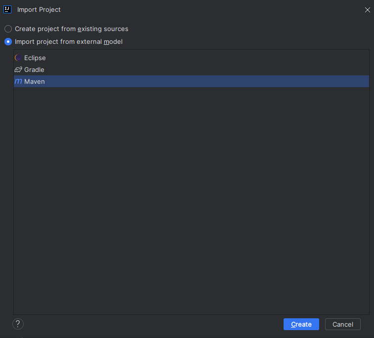

# 使用源码部署

## 准备工作
```
JDK >= 17(推荐17版本)
Mysql >= 8.0(推荐8.0.33版本)
Redis >= 6.0.5
Maven >= 3.0
Node >= 14(推荐14.18.2版本)
```

## 运行系统

前往`Gitee`下载页面(https://gitee.com/wch2019/xiaohai-blog)下载解压到工作目录

### 后端运行

导入到idea，可以按照以下步骤操作：
1. 菜单栏选择`File`-> `New`-> `Project from Existing Sources`（从已有的源代码导入项目）。

  


2. 在弹出的对话框中，选择您要导入的项目的根文件夹，并点击`OK`。

3. 选择您要导入的项目类型Maven并点击`Create`。

   
   
4. 自动加载`Maven`依赖包，初次加载会比较慢（根据自身网络情况而定）

5. 创建数据库`xiaohai_blog`并导入数据脚本`xiaohai_blog.sql`

6. 打开项目运行`com.xiaohai.admin.XiaohaiAdminApplication.java`，出现如下表示启动成功。

   ```
     (♥◠‿◠)ﾉﾞ  启动成功   ლ(´ڡ`ლ)ﾞ 
   ```

>  提示
>
>  后端运行成功可以通过(http://localhost:8089)访问，但是不会出现静态页面，可以继续参考面步骤部署前端，然后通过前端地址来访问。

### 前端后台管理运行

```bash
# 进入项目目录
cd xiaohai-web

# 安装依赖
npm install

# 建议不要直接使用 cnpm 安装以来，会有各种诡异的 bug。可以通过如下操作解决 npm 下载速度慢的问题
npm install --registry=https://registry.npm.taobao.org

# 启动服务
npm run dev
```

浏览器访问 [http://localhost:8080](http://localhost:8080) 默认账户/密码 `admin/123456`

若能正确展示登录页面，并能成功登录，菜单及页面展示正常，则表明后台管理搭建成功

> 提示
>
> 
> 因为本项目是前后端完全分离的，所以需要前后端都单独启动好，才能进行访问。

### 前端展示页运行 

```bash
# 进入项目目录
cd xiaohai-web-show

# 安装依赖
npm install

# 启动服务
npm run dev
```

浏览器访问 http://localhost:4000

> 提示
>
> 
> 因为本项目是前后端完全分离的，所以需要前后端都单独启动好，才能进行访问。

## 必要配置
